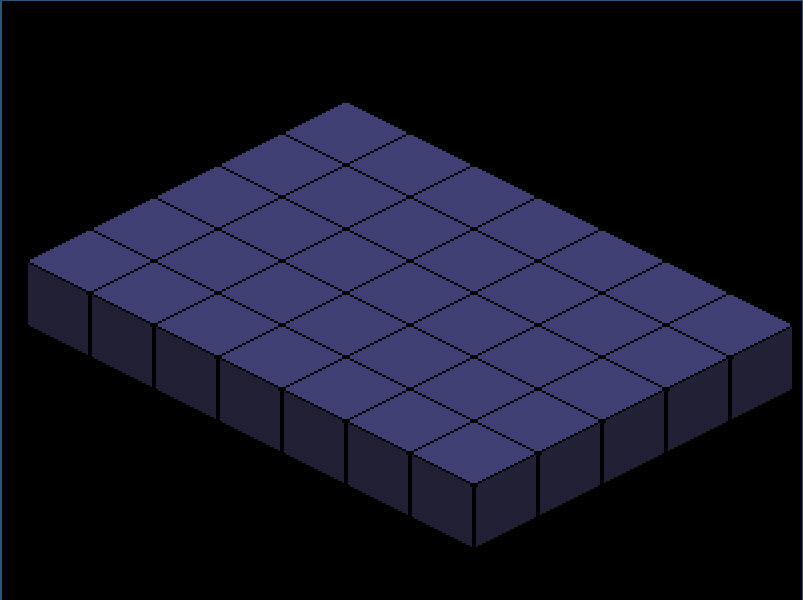
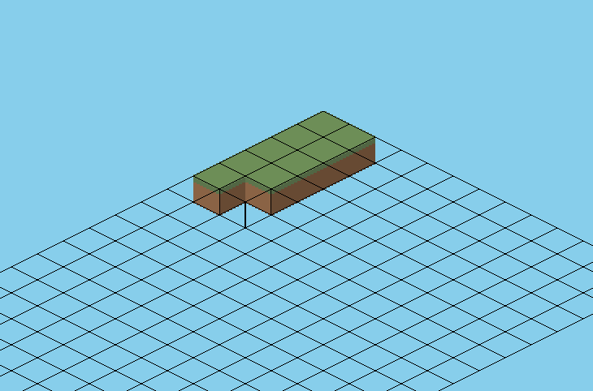

# Pas-Craft
yet another mincarft clone but this time its in pascal which makes me cool in front of other developers, i think. right?        
its developed and tested in linux, i dont know if it works on windows or how to make it work there, for now :O.    

# ToDO
-   Place Tiles [X]
-   Wrapper around sfml for pascal( dont forget the main goal) [X]
-   moving cursor [X]
-   mouse projection 
-   deff textures , set view size for the game

-   Tile Editor [ ]
-   Add Shadow  [ ]
-   Sand And Water Sim [ ]
-   Moving Player [ ]


# Setup And Run
-   install sfml using the installer ``` bash csfml_install.sh ```
-   install sfml binding ``` git submodule update --init --recursive ```
-   run it ``` ./run.sh ```
-   no game yet i need to understand what the fish i am doing


# Dev Imgs


